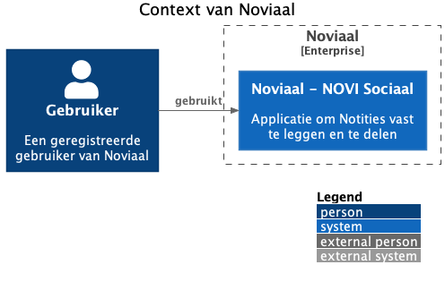
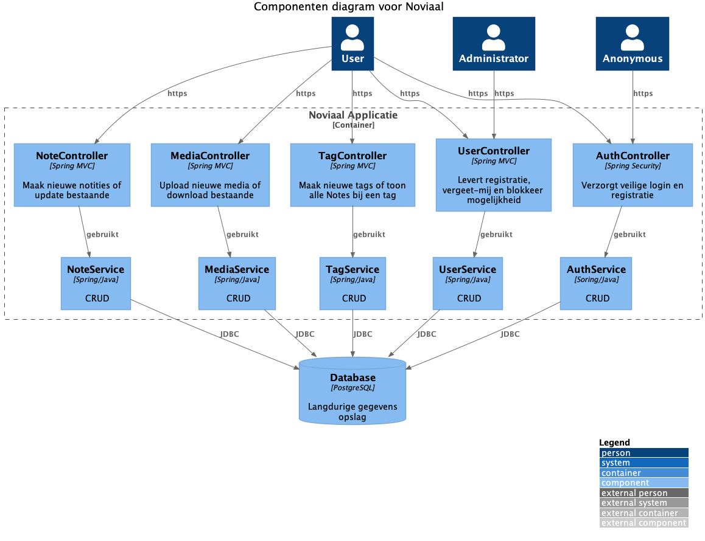
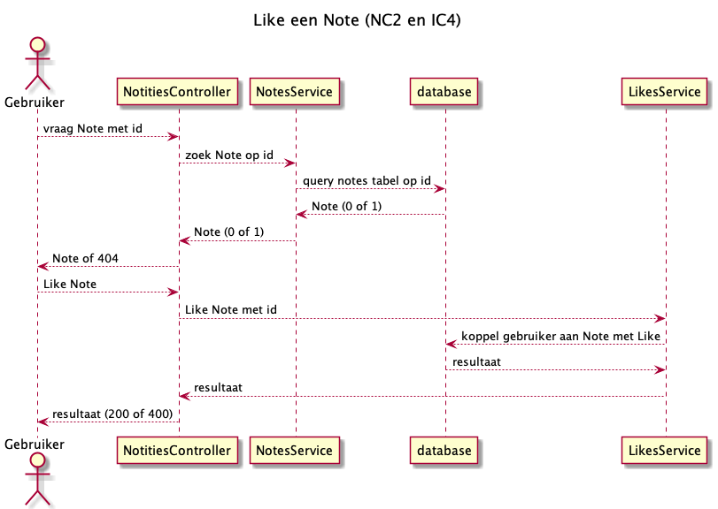

= Noviaal - Novi Sociaal

|======
| Instelling    | NOVI HBO Software Development
| Leerlijn      | BackEnd
| Document      | Functioneel en Technisch Ontwerp voor de Eindopdracht
| Docent        | Nick Stuivenberg
| Datum         | 20 november 2020
| Auteur        | Jurjen Vorhauer
| Studentnummer | 800009793
| GitHub        | https://github.com/jvorhauer/noviaal
| *Noviaal*     | Een Twiiter-achtig platform, een samentrekking van NOVI en Sociaal
|======

<<<

:numbered:
== Functioneel Ontwerp (FO)

Een _platform_ om:

* notities op te slaan,
* om die notities te kunnen vinden, lezen, taggen en liken.
* om andere gebruikers te volgen
* om direct geïnformeerd te worden over nieuwe notities van gevolgde gebruikers.
* om herinnerd te worden aan notities.

De doelgroep is *iedereen* op het internet.

=== Actoren

. Geregistreerde gebruiker (User),
. Administrator (Admin) is een speciale geregistreerde gebruiker die niet-admin gebruikers kan blokkeren,
. Anonieme gebruiker (Reader) kan een indruk krijgen van wat er allemaal gebeurd, maar kan alleen lezen.

=== Entiteiten

De belangrijkste entiteiten in Noviaal zijn:

* Users, gebruikers en
* Notes, notities

Daarnaast zijn er een aantal aanvullende en/of ondersteunende entiteiten:

* Tag, groepering van notities in een bepaalde categorie/met een bepaald label,

=== Startpunten

De geregistreerde gebruiker heeft vier hoofdingangen:

. `/home` is de TimeLine pagina waarop alle notities van gevolgde gebruikers en de eigen notities worden getoond,
. `/mine` geeft alle eigen notities met aantallen likes weer en de gebruikers gegevens,
. `/likes` geeft alle ge-like-te (??) notities weer,
. `/reminders` geeft alle notities waaraan de huidige gebruiker herinnerd wil worden,
. `/followers` geeft alle mij volgende gebruikers weer,
. `/following` geeft alle door mij gevolgde gebruikers weer.

Vanuit ieder van die pagina's kan men naar de details:

* Voor gebruikers is dat een profielpagina, gelijk aan `/mine`, maar dan voor die andere gebruiker en
zonder de mogelijkheden om de notities te wijzigen, maar wel te liken/unliken en reminders te zetten.
De gebruiker kan op deze pagina gevolgd worden
* Voor notities worden de titel, body tekst, aanmaak- en laatste wijzigingsdatums en de auteur getoond.
De notitie van jezelf kun je wijzigen en een reminder op zetten; op notities van anderen kun je liken/unliken, reminder zetten

Bovenaan iedere (startpunt) pagina is een zoekveld, waarmee in gebruikersnamen, tags en notities gezocht kan worden.
Resultaten worden getoond op `/search`.

=== Use Cases

image::documentatie/FO/use-cases.png[Use Cases diagram]

De Use Cases zijn uitgewerkt in het MarkDown document xref:./documentatie/FO/use-cases.adoc[Use Cases]

De broncode van het Use Case diagram is PlantUML, zie https://plantuml.com/use-case-diagram[Use Case diagram]

== Niet-Functionele Eisen

=== Kwaliteit

Unit test coverage moet boven de 80% zijn. Dat wil zeggen dat 80% van de regels code in de applicatie automatisch getest moeten worden.
Voor het rapporteren van de test coverage gaat gebruik gemaakt worden van https://www.eclemma.org/jacoco/[JaCoCo]. De test coverage wordt iedere keer dat de applicatie gebouwd wordt, getest en over gerapporteerd.

Het project zal alleen release versies van gebruikte dependencies gebruiken. Deze dependencies zullen actief gecheckt worden, zodat mogelijke (veiligsheid) fouten direct opgelost worden, zodra een verbeterde versie ter beschikking is. Hiervoor wordt gebruik gemaakt van DependaBot van GitHub.

Door het gebruik van Continuous Integration (CI) om het project te bouwen, iedere keer dat er een update gepushed wordt, is de kwaliteitsbewaking continue.

=== Internet

De Noviaal Applicatie kan lokaal op een PC of laptop gedraaid worden zonder internet verbinding.

Voor het bouwen van het project tot een werkende applicatie is een internet verbinding nodig. De build tool (Maven) gaat de dependencies van repositories op internet ophalen.

Aangezien er van Docker compose gebruik gemaakt gaat worden om de database en de applicatie op te starten, is er eenmalig
een internet verbinding nodig om de PostgreSQL image en een standaard Linux image met Java te downloaden.

Dus: voor bouwen en installeren is wel een internet verbinding nodig, voor het draaien van de Noviaal applicatie is geen internet verbinding nodig.

=== Veiligheid

Zolang de applicatie alleen lokaal gedraaid gaat worden is het niet nodig om SSL voor hhtps in te richten en is ook MultiFactor Authenticatioon (MFA) niet nodig.
Inloggen is bedoeld om onderscheid te kunnen maken tussen de verschillende gebruikers, zodat de interactie tussen die gebruikers zichtbaar gemaakt kan worden.

=== Performance

Er zijn geen eisen gesteld aan de performance van het systeem. Er wordt dan ook vanuit gegaan dat er voldoende CPU en intern geheugen (RAM) in de machine waarop de Noviaal applicatie gedraaid wordt, aanwezig zijn.

Ook voor response tijden zijn geen eisen gegeven. Er zijn dus geen performance tests, laat staan performance optimalisaties gepland voor Noviaal.

=== Data recovery

Er is geen backup van de database gepland.

<<<

== Technisch Ontwerp (TO)

=== Classes

image::documentatie/TO/class-diagram.png[Class diagram]

NB: met de eerste versie is het niet mogelijk om Tags te bewerken.

=== C4 diagrammen

Zie vooral eerst https://c4model.com[C4 Architectuur Model].

'''

image::documentatie/FO/c4-container-diagram.png[Container diagram]

'''

'''

=== Sequence diagrammen

image::documentatie/TO/seq-diags/seq-new-note.png[Nieuwe notitie]

Update notitie gaat vergelijkbaar als deze nieuwe notitie sequentie, maar dan met een bestaande notitie.

image::documentatie/TO/seq-diags/registreer.png[Registreer nieuwe gebruiker]

image::documentatie/TO/seq-diags/zoek.png[Zoek]

De meeste lijsten van notities en gebruikers werken op dezelfde manier: op basis van een query wordt een lijst met resultaten terug gegeven.

Het zetten van een reminder werkt vergelijkbaar met het liken van een notitie.

NB: om sequence diagram overload te voorkomen zijn de eenvoudiger use cases niet gedaan.

=== EndPoints

Een overzicht van de endpoints die extern beschikbaar worden gemaakt voor gebruikers (Web, http/html/css/js) en andere apps (API, http/json).

==== Notities

Voor alle gebruikers (ingelogd of anoniem), behalve privé notities: deze zijn alleen zichtbaar voor de eigenaar/auteur

* lijst van alle notities van een bepaalde gebruiker (OC2)
* lijst van alle gelikede (door huidige gebruiker) notities (OC3)
* lijst van alle notities met reminder (van huidige gebruiker) (OC4)
* lijst van alle notities met een zoekwoord in titel of body (IC3 \-> OC1)

Alleen voor ingelogde, huidige gebruiker:

* maak een nieuwe notitie (NC1),
* wijzig een bestaande, eigen notitie (titel en/of body) (NC3),
* like een bepaalde notitie (IC4),
* unlike een bepaalde notitie (IC5),
* zet een reminder voor een bepaalde notitie (IC7),
* zet de tag(s) van een bepaalde, eigen notitie (NC5).

==== Users

Voor alle gebruikers (ingelogd of anoniem):

* lijst van alle gebruikers
* lijst van gebruikers die ik (de ingelogde, huidige gebruiker) volg (OC6)
* lijst van gebruikers die mij (de ingelogde, huidige gebruiker) volgen (OC5)
* lijst van gebruikers met een zoekwoord in email adres of naam (IC3 \-> OC1)
* toon details, inclusief alle niet-privé notities (NC2)

Voor anonieme gebruikers:

* registreer als gebruiker (AC1)

Voor geregistreerde gebruilkers:

* Vergeet mij, verwijder mij en mijn notities, etc. uit Noviaal (AC5)
* Volg een gebruiker (IC1)
* Stop met volgen van een gebruiker (IC2)

==== TimeLine

Voor alle gebruikers (ingelogd of anoniem):

* Toon de TimeLine: notities van gebruikers die ik (de huidige, ingelogde gebruiker) volg of ik een reminder voor heb gezet én mijn eigen notities.

=== Voorwaarden

. Installatie van Java 11 (meest recente versie) is aanwezig.
. Docker is geinstalleerd en werkzaam.

=== Hulpmiddelen etc.

https://jdk.java.net/11/[Java], meest recente Long Term Supported (LTS) versie (nu: 11)
https://spring.io/projects/spring-boot[Spring Boot], versie 2.4.0
https://spring.io/projects/spring-security[Spring Security], versie 5.4.1

https://maven.apache.org[Maven], versie 3.6.3

https://travis-ci.com/getting_started[TravisCI]

<<<

== Persoonlijk

Dit zijn mijn eigen notities en deze zijn niet officieel onderdeel van de project documentatie.

De lol zit 'm in de event publisher en listener(s) combinatie: als een nieuwe notitie succesvol is bewaard in de database,
dan wordt een event uitgestuurd om alle volgers van de schrijver van deze note te informeren.
Daarna kunnen de 'luisteraars' naar zo'n event actie ondernemen, door bijvoorbeeld de lijst van meest recente notities automatisch op te halen.

Ditzelfde mechanisme kan ook gebruikt worden om updates van notities, likes van notities en wellicht meer te luisteren.

Dus:

* Notitie aanmaken
* Selecteer uit de database welke volgers van de auteur (User) van de note genotificeerd moeten worden
* Event uitsturen

Query: haal user van note op, haal alle volgers op van gebruiker, stuur id van note naar al die volgers.

=== Mogelijk nuttige links

* https://dzone.com/articles/server-sent-events-using-spring[SSE using Spring]
* https://www.baeldung.com/spring-events[Spring Events]
* https://github.com/spring-projects/spring-security/blob/5.4.1/samples/boot/helloworld/[Spring Security - Sample]
* https://www.codejava.net/frameworks/spring-boot/spring-boot-security-authentication-with-jpa-hibernate-and-mysql[Spring Security - JPA]
* https://docs.spring.io/spring-security/site/docs/5.4.1/reference/html5/#servlet-authentication[Spring Security - Authentication]
* https://medium.com/@kamer.dev/spring-boot-user-registration-and-login-43a33ea19745[Registratie en Login]
* https://docs.spring.io/spring-security/site/docs/current/reference/html5/#multiple-httpsecurity[Web en API security mix]
* https://www.baeldung.com/spring-security-track-logged-in-users[Track Logged In Users]
* https://vladmihalcea.com/the-best-way-to-map-a-onetomany-association-with-jpa-and-hibernate/[ManyToOne done right]
* https://github.com/plantuml-stdlib/C4-PlantUML[C4 PlantUML]
