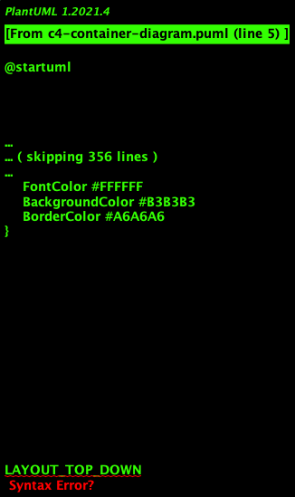

# Noviaal - Novi Sociaal

Een *platform* om:

* notities op te slaan,
* om die notities te kunnen vinden, lezen, taggen en liken.
* om andere gebruikers te volgen
* om direct geïnformeerd te worden over nieuwe notities van gevolgde gebruikers.
* om herinnerd te worden aan notities.

De doelgroep is *iedereen*.

## FO

De Use Cases zijn uitgewerkt in het MarkDown document [Use Cases](./document/FO/use-cases.md)

De broncode van het Use Case diagram is PlantUML, zie [Use Case diagram](https://plantuml.com/use-case-diagram)

### Actoren

1. Geregistreerde gebruiker (User),
2. Administrator (Admin) is een speciale geregistreerde gebruiker die niet-admin gebruikers kan blokkeren,
3. Anonieme gebruiker (Reader) kan een indruk krijgen van wat er allemaal gebeurd, maar kan alleen lezen.

### Entiteiten

De belangrijkste entiteiten in Noviaal zijn:

* Users, gebruikers en
* Notes, notities

Daarnaast zijn er een aantal aanvullende en/of ondersteunende entiteiten:

* Tag, groepering van notities in een bepaalde categorie/met een bepaald label,

### Startpunten

De geregistreerde gebruiker heeft vier hoofdingangen:

1. /home is de TimeLine pagina waarop alle notities van gevolgde gebruikers en de eigen notities worden getoond,
2. /mine geeft alle eigen notities met aantallen likes weer,
3. /likes geeft alle ge-like-te (??) notities weer,
4. /reminders geeft alle notities waaraan de huidige gebruiker herinnerd wil worden.

Bovenaan iedere (startpunt) pagina is een zoekveld, waarmee in gebruikersnamen, tags en notities gezocht kan worden.
Resultaten worden getoond op /search

### Flows

Vanuit de verschillende startpunt pagina's kan een geregistreerde gebruiker naar een specifieke note.
Die gebruiker kan iedere note liken, er een een reminder aan toe voegen en commentaar geven de note.

Alleen de eigenaar, degene die de notitie gemaakt heeft, kan de notitie ook wijzigen.

## TO

### Classes

NB: met de eerste versie is het niet mogelijk om Tags te bewerken.

### C4 diagrammen

Zie vooral eerst [C4 Architectuur Model](https://c4model.com).

---

---

### Sequence diagrammen

__TODO__ hoe flowt de gebruiker van controller naar service naar db en weer terug...

### EndPoints

####

## Niet-Functionele Eisen

### Kwaliteit

Unit test coverage moet boven de 80% zijn. Dat wil zeggen dat 80% van de regels code in de applicatie automatisch getest moeten worden.
Voor het rapporteren van de test coverage gaat gebruik gemaakt worden van [JaCoCo](https://www.eclemma.org/jacoco/). De test coverage wordt iedere keer dat de applicatie gebouwd wordt, getest en over gerapporteerd.

Het project zal alleen release versies van gebruikte dependencies gebruiken. Deze dependencies zullen actief gecheckt worden, zodat mogelijke (veiligsheid) fouten direct opgelost worden, zodra een verbeterde versie ter beschikking is. Hiervoor wordt gebruik gemaakt van DependaBot van GitHub.

Door het gebruik van Continuous Integration (CI) om het project te bouwen, iedere keer dat er een update gepushed wordt, is de kwaliteitsbewaking continue.

### Internet

De Noviaal Applicatie kan lokaal op een PC of laptop gedraaid worden zonder internet verbinding.

Voor het bouwen van het project tot een werkende applicatie is een internet verbinding nodig. De build tool (Maven) gaat de dependencies van repositories op internet ophalen.

Aangezien er van Docker compose gebruik gemaakt gaat worden om de database en de applicatie op te starten, is er eenmalig
een internet verbinding nodig om de PostgreSQL image en een standaard Linux image met Java te downloaden.

Dus: voor bouwen en installeren is wel een internet verbinding nodig, voor het draaien van de Noviaal applicatie is geen internet verbinding nodig.

### Veiligheid

Zolang de applicatie alleen lokaal gedraaid gaat worden is het niet nodig om SSL voor hhtps in te richten en is ook MultiFactor Authenticatioon (MFA) niet nodig.
Inloggen is bedoeld om onderscheid te kunnen maken tussen de verschillende gebruikers, zodat de interactie tussen die gebruikers zichtbaar gemaakt kan worden.

### Performance

Er zijn geen eisen gesteld aan de performance van het systeem. Er wordt dan ook vanuit gegaan dat er voldoende CPU en intern geheugen (RAM) in de machine waarop de Noviaal applicatie gedraaid wordt, aanwezig zijn.

Ook voor response tijden zijn geen eisen gegeven. Er zijn dus geen performance tests, laat staan performance optimalisaties gepland voor Noviaal.

### Data recovery

Er is geen backup of andere maatregelen ter behoud van de data in de database gepland.

### Hulpmiddelen etc.

[Java](), meest recente Long Term Supported (LTS) versie (nu: 11)
[Spring Boot](), versie 2.4.0
[Spring Security](), versie 5.4.1

[Maven](), versie 3.6.3

[TravisCI](https://travis-ci.com/getting_started)

## Persoonlijk

Dit zijn mijn eigen notities en deze zijn niet officieel onderdeel van de project documentatie.

De lol zit 'm in de event publisher en listener(s) combinatie: als een nieuwe note succesvol is bewaard in de database,
dan wordt een event uitgestuurd om alle volgers van de schrijver van deze note te informeren.
Daarna kunnen de 'luisteraars' naar zo'n event actie ondernemen, door bijvoorbeeld de lijst van meest recente notities automatisch op te halen.

Ditzelfde mechanisme kan ook gebruikt worden om updates van notities, likes van notities en wellicht meer te luisteren.

Dus:
* Note aanmaken
* Event uitsturen
* Selecteer uit de database welke volgers van de auteur (User) van de note genotificeerd moeten worden
* Emit een SSE event

Query: haal user van note op, haal alle volgers op van gebruiker, stuur id van note naar al die volgers.

### Links

- [SSE using Spring](https://dzone.com/articles/server-sent-events-using-spring)
- [Spring Events](https://www.baeldung.com/spring-events)
- [Spring Security - Sample](https://github.com/spring-projects/spring-security/blob/5.4.1/samples/boot/helloworld/)
- [Spring Security - JPA](https://www.codejava.net/frameworks/spring-boot/spring-boot-security-authentication-with-jpa-hibernate-and-mysql)

- [ManyToOne done right](https://vladmihalcea.com/the-best-way-to-map-a-onetomany-association-with-jpa-and-hibernate/)
