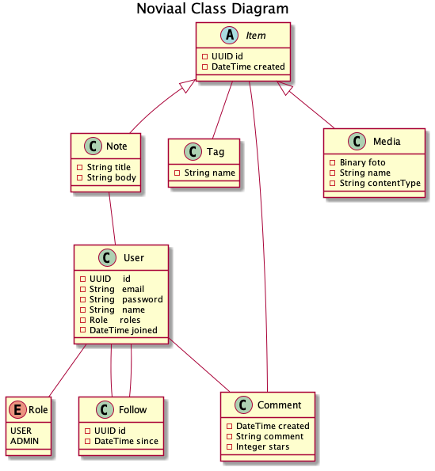
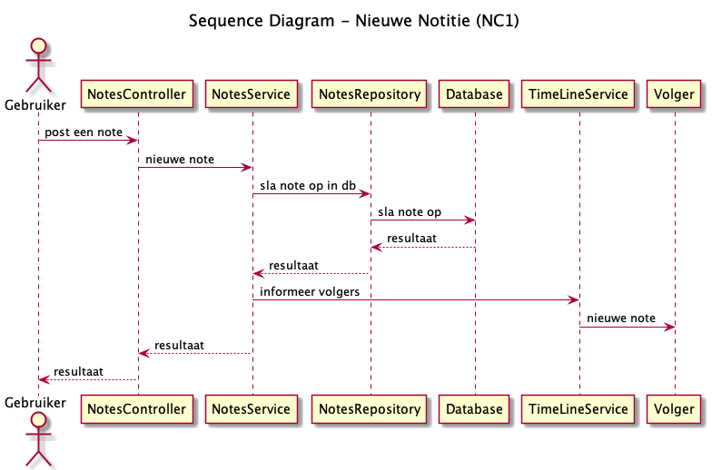
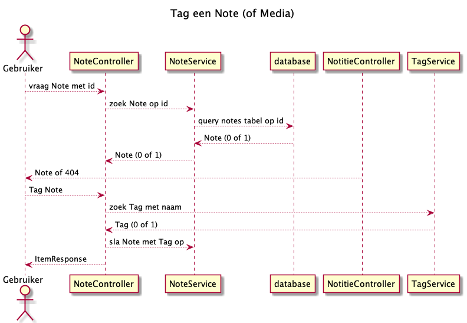

= Noviaal - Technish Ontwerp met Class diagram en 2 Sequence diagrammen
:toc: macro

|======
| Instelling    | NOVI HBO Software Development
| Leerlijn      | BackEnd
| Document      | Functioneel en Technisch Ontwerp voor de Eindopdracht
| Docent        | Nick Stuivenberg
| Datum         | 20 november 2020
| Auteur        | Jurjen Vorhauer
| Email         | J.Vorhauer@novi-education.nl
| Studentnummer | 800009793
| GitHub        | https://github.com/jvorhauer/noviaal
| *Noviaal*     | Een Twitterig platform, de naam is een samentrekking van NOVI en Sociaal
|======

<<<

toc::[]

<<<

== Inleiding

Dit is het technisch ontwerp van Noviaal

=== Classes

NB: met de eerste versie is het niet mogelijk om Tags te bewerken.

=== Componenenten diagram

Zie vooral eerst https://c4model.com[C4 Architectuur Model].

image::c4-component-diagram.png[Componenten diagram]

'''

=== Sequence diagrammen

Update notitie gaat vergelijkbaar als deze nieuwe notitie sequentie, maar dan met een bestaande notitie.

image::seq-diags/registreer.png[Registreer nieuwe gebruiker]

